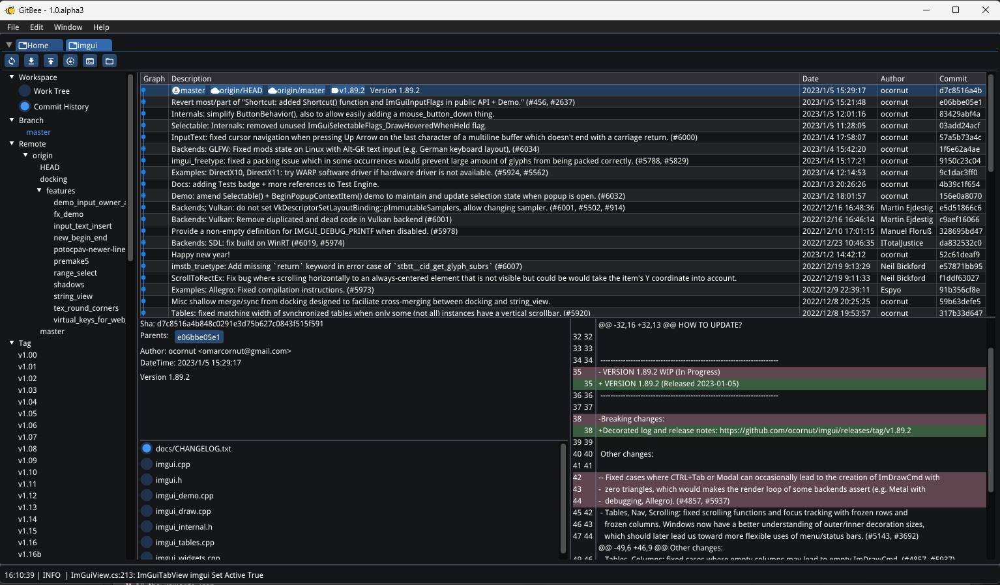
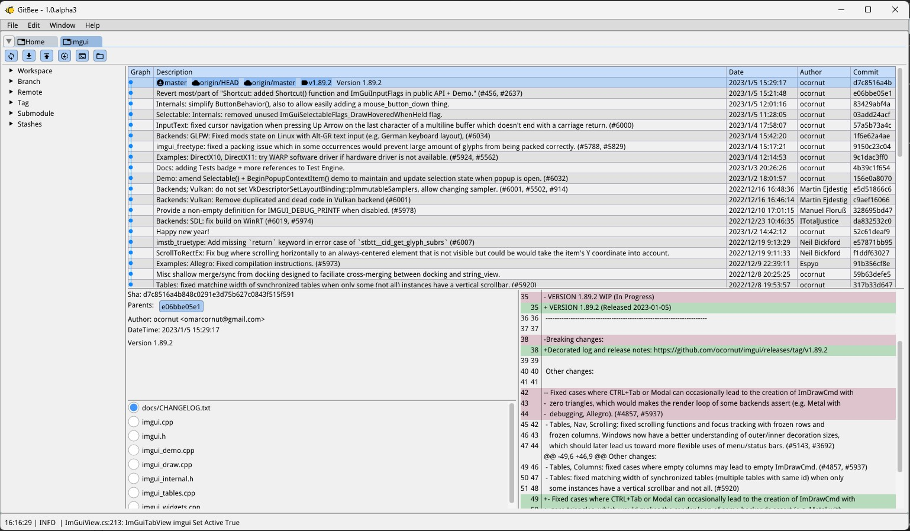
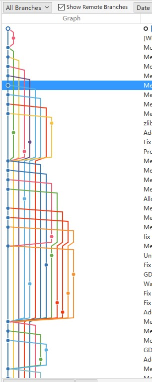
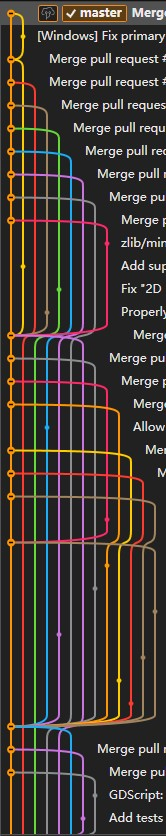

# GitBee

用ImGui实现的轻量级Git界面管理软件  

支持基本的Git历史记录浏览、差异对比、分支操作、提交、推送等  
默认支持ImGui Dark/Light两种界面样式  
保持美观、轻量、直观、不崩溃， 希望能坚持下去    

### 中文输入跟随支持
ImGui.NET SDL对输入法的支持压根没有，极其难用，这里用通过C++的底层交互，实现了输入法的跟随  
每次体验感觉写个文本编辑器都可以,还不错...

### 扩展方向
支持lua作为插件脚本

### 图谱预览实现
勉强实现，不卡性能，简单的看看还可以，对于复杂的谱图支持还不直观， 表现上优化好难...  
下面为其他软件的参考截图

### 内存优化
想实现小而美的软件，默认200MB+的内存占用，感觉还是有点夸张。  
主要原因还是在于ImGui使用静态字符缓存，在调用`ImGui.GetIO().Fonts.GetGlyphRangesChineseFull()`本身使用中文全字符集，会生成一张8K的字体纹理，内存直接跳到200MB+,如果使用`ImGui.GetIO().Fonts.GetGlyphRangesChineseSimplifiedCommon`,虽然这里只占用40-50MB，但是这里只有2500个中文字符，明显不够用。折中这里使用了自定义字符集,读取在`lua/style/chinese.txt`里面的默认3500个字符,虽然也可能出现不显示的字符，体验不完美，但是至少可以手动添加作为弥补，把内存控制到了70MB+。
ImGui就算这个不使用全字符集的字体内存的占用，感觉还是有点夸张的，看后面有没有更好的解决方案
